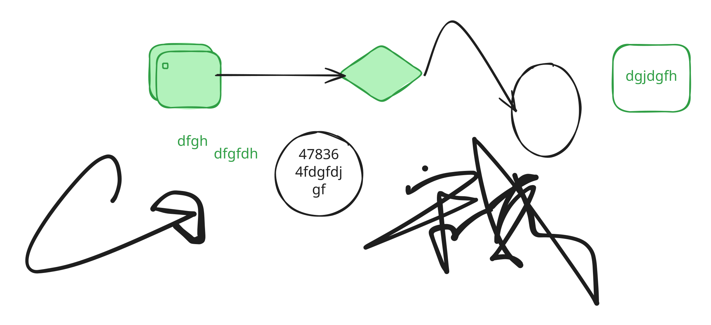
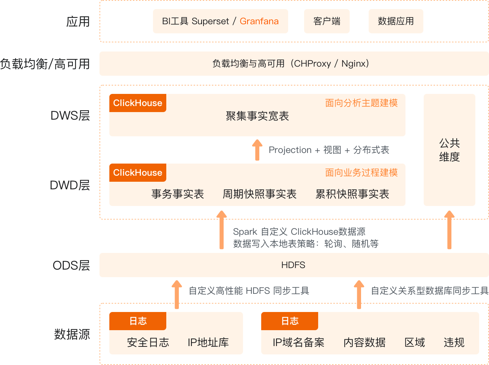

# Page

jdhhgksksnkjkgksdigri

#### ffjgkdsgdksjgkds

1. ssdgfsdgksd
2. dsgkdsgkgksd
3. sdjgsdjgsdgdsgkgks&#x20;

```bash
// Some code
sudo apt-get update
sudo apt-get install \
    ca-certificates \
    curl \
    gnupg \
    lsb-release

curl -fsSL https://download.docker.com/linux/ubuntu/gpg | sudo gpg --dearmor -o /usr/share/keyrings/docker-archive-keyring.gpg

echo \
  "deb [arch=$(dpkg --print-architecture) signed-by=/usr/share/keyrings/docker-archive-keyring.gpg] https://download.docker.com/linux/ubuntu \
  $(lsb_release -cs) stable" | sudo tee /etc/apt/sources.list.d/docker.list > /dev/null

sudo apt-get update
sudo apt-get install docker-ce docker-ce-cli containerd.io

```

1. :joy:sfgskdgkdsg

sdhksdhgjskdghsdhgsdhgdsghjdsghruowu

fdhkfgkfhgfghfhglghlfgl

dfhgkfkfdhgfjhgfkhgfhg

<table data-full-width="true"><thead><tr><th></th><th></th><th></th><th></th></tr></thead><tbody><tr><td>a</td><td>b</td><td>c</td><td></td></tr><tr><td>d</td><td>e</td><td>f</td><td></td></tr><tr><td>g</td><td>h</td><td>g</td><td></td></tr></tbody></table>

<table data-view="cards"><thead><tr><th></th><th></th><th></th></tr></thead><tbody><tr><td>dhfgkhksdjhkdshlsghsdkhgskdjhgksdjg</td><td></td><td></td></tr><tr><td>sgsg</td><td>sdgsdgsdgsgsgsdg</td><td></td></tr><tr><td>sgsdgsdg</td><td>sdgsdg</td><td></td></tr></tbody></table>

***



gjzdjhgdsjgfdsghj



sdgsdg









## Create a new user

<mark style="color:green;">`POST`</mark> `/users`

\<Description of the endpoint>

**Headers**

| Name          | Value              |
| ------------- | ------------------ |
| Content-Type  | `application/json` |
| Authorization | `Bearer <token>`   |

**Body**

| Name   | Type   | Description      |
| ------ | ------ | ---------------- |
| `name` | string | Name of the user |
| `age`  | number | Age of the user  |

**Response**



```json
{
  "id": 1,
  "name": "John",
  "age": 30
}
```



```json
{
  "error": "Invalid request"
}
```





```javascript
const message = "hello world";
console.log(message);
```



```python
message = "hello world"
print(message)
```



```ruby
message = "hello world"
puts message
```




1.
2. 
3. sdguisdgisdgi
